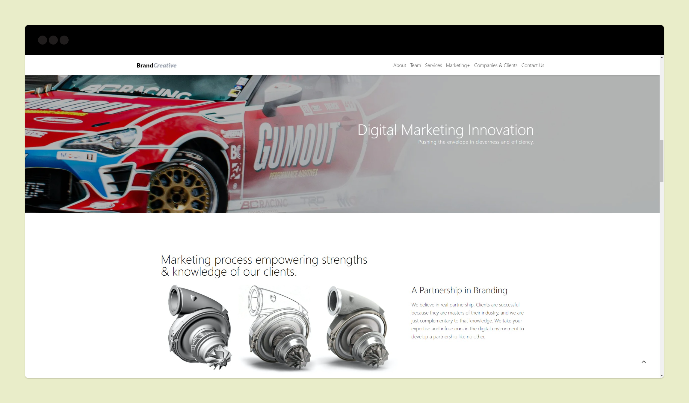

<div align="center">
    <h1>Brandcreative LLC.</h1>
    <p>Brandcreative, LLC is a Southern California based Full-Service Marketing+ and Industrial Design Firm.</p>
</div>




## Run it on your machine

1. Clone the project

   ```sh
   git clone https://github.com/aznamle/brandcreative.git
   ```

1. Install the dependencies

   ```sh
   cd brandcreative
   npm install
   ```

3. Start the development server

   ```sh
   npm start
   ```

<div align="center">
    <p>
        Built with <a href="https://www.nextjs.org/" target="_blank">Next.js</a> and hosted with <a href="https://www.vercel.com/" target="_blank">Vercel</a>
    </p>
</div>